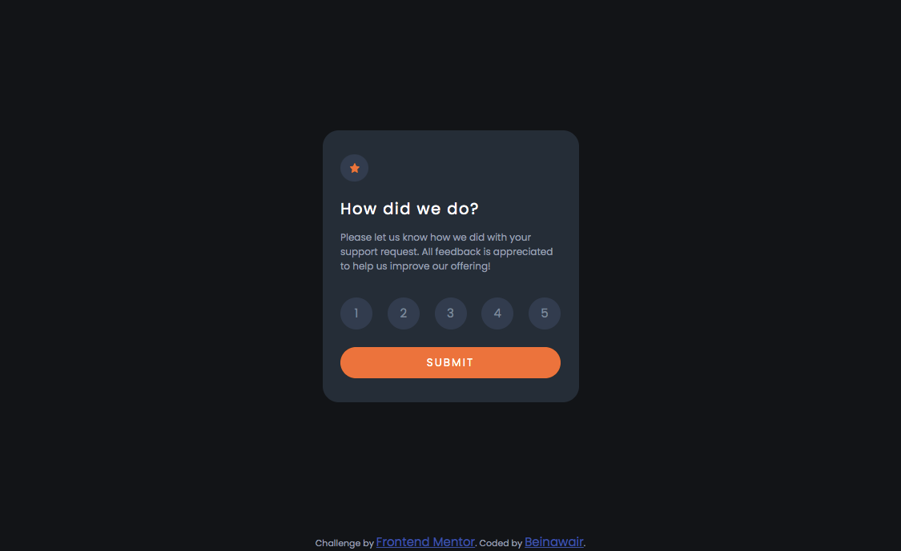

# Frontend Mentor - Interactive rating component solution

This is a solution to the [Interactive rating component challenge on Frontend Mentor](https://www.frontendmentor.io/challenges/interactive-rating-component-koxpeBUmI). Frontend Mentor challenges help you improve your coding skills by building realistic projects. 

## Table of contents

- [Overview](#overview)
  - [The challenge](#the-challenge)
  - [Screenshot](#screenshot)
  - [Links](#links)
- [My process](#my-process)
  - [Built with](#built-with)
  - [What I learned](#what-i-learned)
  - [Continued development](#continued-development)
  - [Useful resources](#useful-resources)
- [Author](#author)
- [Acknowledgments](#acknowledgments)

**Note: Delete this note and update the table of contents based on what sections you keep.**

## Overview

In this challenge, I need to create an interactive rating section and make it as identical as the pictures that given to me.

### The challenge

Users should be able to:

- View the optimal layout for the app depending on their device's screen size
- See hover states for all interactive elements on the page
- Select and submit a number rating
- See the "Thank you" card state after submitting a rating

### Screenshot

### Links

- Solution URL: [Add solution URL here](https://github.com/beinawair/interactive-rating-component)
- Live Site URL: [Add live site URL here](https://beinawair.github.io/interactive-rating-component/)

## My process

It was a fun challenge! I learned a lot from just this one. at first I found it difficult to select element selected from start to show it in the thank you section. But then after some research on google, I still could not find the answer but then accidentally I found it when I try to console log every element that I think might be the answer. I'd love to do more challenge in the future

### Built with

- Semantic HTML5 markup
- CSS custom properties
- Flexbox
- CSS Grid
- Mobile-first workflow
- Sass

### What I learned

At first I struggled to just print the selected rting to the thank you page, but after some research (though I still can not find the right solution), I accidentally found the answer when I try to console log every element that I thought might be the answer..

here is the code:
--JS--

btn.addEventListener('click', () => {
    const active = document.querySelector('.btn-choice.active')
    let ind = rating.indexOf(active) + 1;
    selected.innerText = ind;
}

### Continued development

Well, I think I might try to write more efficient and more effective code for this one and also adding some animation into it.

## Author

- Website - [Add your name here](https://beinawair.com)
- Frontend Mentor - [@yourusername](https://www.frontendmentor.io/profile/beinawair)
- Twitter - [@yourusername](https://www.twitter.com/beinawair)

## Acknowledgments

Then, yes this is my first challenge I took from Frontend Mentor and also this is part of my journey on becoming a full stack Frontend Developer. Thank You!
